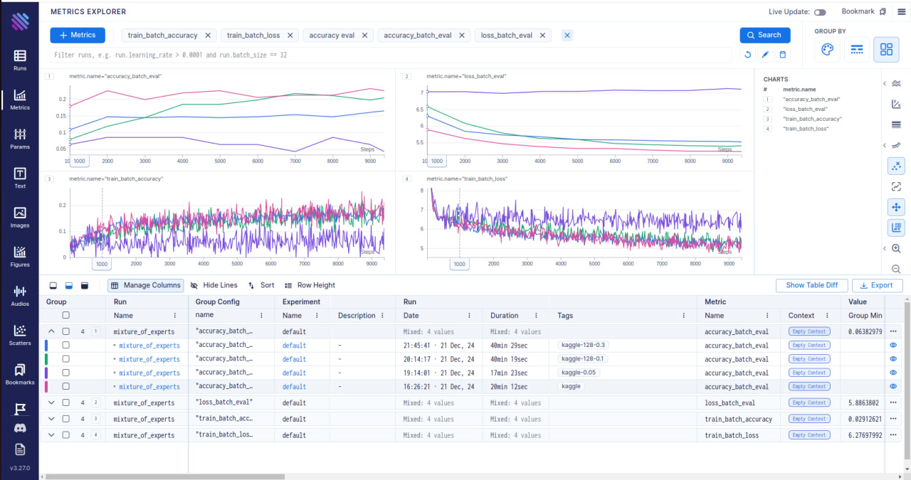

# Mixture-of-Experts
Проектная работа по курсу Advanced NLP. Transformer encoder с заменой MLP-блока на MOE для задачи MLM


# Запуск эскпериментов
* для получения пояснений к параметрам введите опцию --help

### 1. Запуск формирования датасета
```bash
python data_processors/load_dataset.py --config-name dataset_params.yaml
```

### 2. Запуск процесса маскирования датасетов сформированных на предыдущем шаге
```bash
python data_processors/dataset.py --config-dataset dataset_params.yaml --config-model model_params.yaml
```

### 3. Запуск обучения
```bash
python train/train.py --config-model model_params.yaml --config-dataset dataset_params.yaml --config-train train_params.yaml
```

### 4. Запуск инференса
```bash
python inference/inference.py --config-model model_params.yaml --config-dataset dataset_params.yaml --config-train train_params.yaml --save_path process_exp_results/results
```
или с параметрами по умолчанию 
```bash
python inference/inference.py
```

## Aim для отслеживания экспериментов

Установить, если не установлен
```bash
pip install aim
```

Поднять UI
```bash
aim up
```

Запуск обучения с логированием эксперимента в Aim
```bash
python train/train.py --tag name
```

# Результаты экспериментов

### Обученные модели
1. seg_len=64 mask_prob=0.15 - розовая (без тега)
2. seg_len=64 mask_prob=0.05 - фиолетовая (тег kaggle)
3. seg_len=128 mask_prob=0.1 - зеленая (тег kaggle-128-0.1)
4. seg_len=128 mask_prob=0.3 - темно-синяя (тег kaggle-128-0.3)

seg_len - максимальная длина последовательности  
mask_prob - процент замаскированных токенов в одной последовательности длины seg_len


