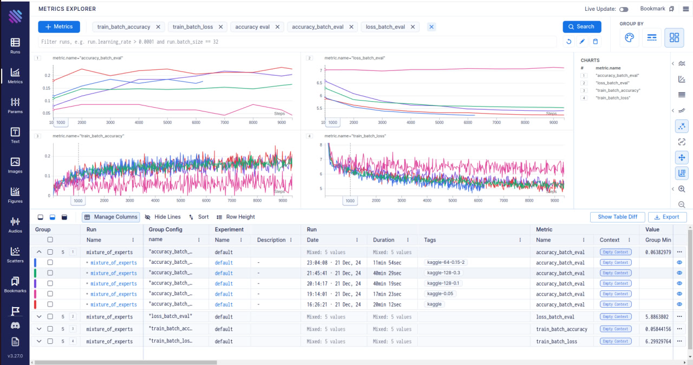
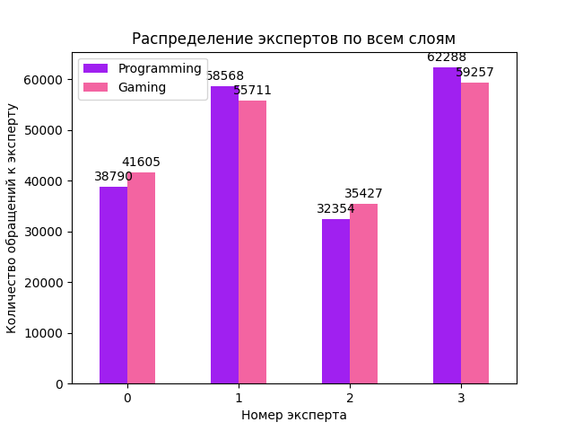
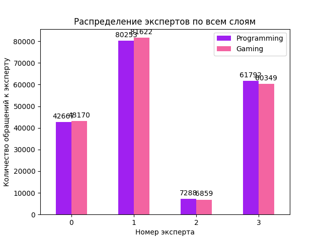
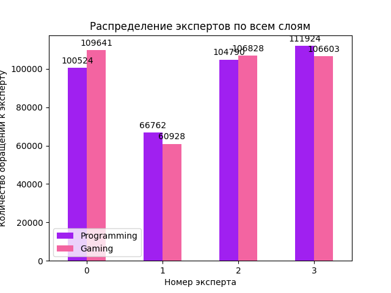
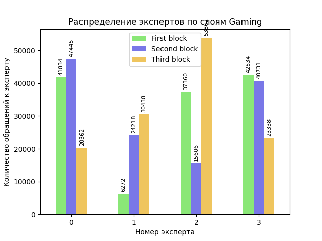
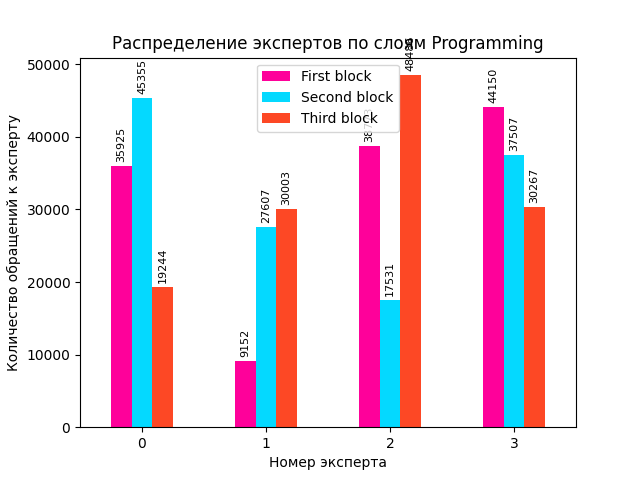

# Mixture-of-Experts
Проектная работа по курсу Advanced NLP. Transformer encoder с заменой MLP-блока на MOE для задачи MLM

# Архитектура

Реализована архитектура трансформер-энкодера с заменой FFN на MoE блок

  

[GShard paper](https://arxiv.org/abs/2006.16668)

  

[Switch Transformers paper](https://arxiv.org/abs/2101.03961)

### TopK выбор экспертов

Кроме того был выбран Sparse MoE подход и реализован topK выбор экспертов по принципу статьи [Mixtral of Experts](https://arxiv.org/pdf/2401.04088)

  

[Guide for mixture of experts](hhttps://newsletter.maartengrootendorst.com/p/a-visual-guide-to-mixture-of-experts#footnote-3-148217245)


# Запуск эскпериментов
* для получения пояснений к параметрам введите опцию --help

### 1. Запуск формирования датасета
```bash
python data_processors/load_dataset.py --config-name dataset_params.yaml
```

### 2. Запуск процесса маскирования датасетов сформированных на предыдущем шаге
```bash
python data_processors/dataset.py --config-dataset dataset_params.yaml --config-model model_params.yaml
```

### 3. Запуск обучения
```bash
python train/train.py --config-model model_params.yaml --config-dataset dataset_params.yaml --config-train train_params.yaml
```

### 4. Запуск инференса
```bash
python inference/inference.py --config-model model_params.yaml --config-dataset dataset_params.yaml --config-train train_params.yaml --save_path process_exp_results/results
```
или с параметрами по умолчанию 
```bash
python inference/inference.py
```

## Aim для отслеживания экспериментов

Установить, если не установлен
```bash
pip install aim
```

Поднять UI
```bash
aim up
```

Запуск обучения с логированием эксперимента в Aim
```bash
python train/train.py --tag name
```

# Результаты экспериментов

### Обученные модели
1. seg_len=64 mask_prob=0.15 - красная (без тега)
2. seg_len=64 mask_prob=0.05 - розовая (тег kaggle)
3. seg_len=128 mask_prob=0.1 - фиолетовая (тег kaggle-128-0.1)
4. seg_len=128 mask_prob=0.3 - зеленая (тег kaggle-128-0.3)
5. seg_len=64 mask_prob=0.15 - темно-синяя (тег kaggle-64-0.15-2)  
    модель 5) обучена на данных выбранных с учетом других тестируемых топиков

seg_len - максимальная длина последовательности  
mask_prob - процент замаскированных токенов в одной последовательности длины seg_len



### Гистограммы активаций экспертов на тестируемых топиках

---
###  seg_len=64 mask_prob=0.15  
|          |     seg_len=64 mask_prob=0.15      |
| -------- | -------- |
|  |  |

---
###  seg_len=64 mask_prob=0.05
|          |     seg_len=64 mask_prob=0.05     |
| -------- | -------- |
|  |  |

---
###  seg_len=128 mask_prob=0.1 
|          |    seg_len=128 mask_prob=0.1    |
| -------- | -------- |
|  |  |

---
###  seg_len=128 mask_prob=0.3 
|          |    seg_len=128 mask_prob=0.3    |
| -------- | -------- |
|  |  |

---

# Выводы

* Для достижения наилучшего результата при маскировании данных необходимо найти золотую середину между длиной последовательности и процентом замаскированных токенов: 
    * хуже всего обучилась модель с 5% замаскированных токенов, то есть от 1 до 3 токенов в последовательности из 64
    * наилучший резульатат достигла модель с 15% замаскированными токенами от длины последовательности 64 

* Не выявлено разительных отличий в активации экспертов на разные топики, скорее всего это связано с качетвом датасета - стиль повествования и тексты у разных топиков не сильно отличаются. Кроме того, при воссоздании архитектуры были изучены другие исследования, в которых отмечено, что эксперты скорее регируют больше на "технические" особенности текста, например подмечают особую пунктуацию, а не тематику текста